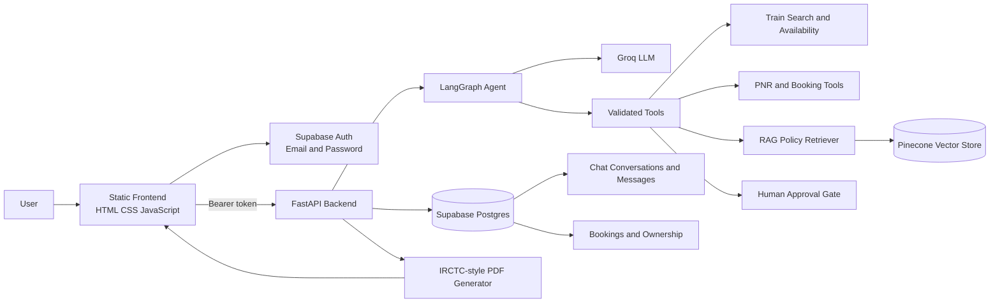

<div align="center">

# 🚆 Rail Assist AI

### *Your intelligent railway journey, powered by agentic AI.*

<p>
  
  
  
  
  
  
  
  
</p>

<p><strong>Search trains. Understand policies. Book confidently. Travel smarter.</strong></p>

</div>

> **“A conversational AI assistant for Indian Railway discovery, booking workflows, PNR support, and policy guidance.”**

Rail Assist AI is an agentic railway-support application built as a portfolio project. Users can chat naturally with an AI assistant to search trains, check PNR status, understand refund policies, create demo bookings, cancel tickets, file complaints with approval, and download IRCTC-style electronic reservation slips.

## Features

- Natural-language railway assistant with LangGraph orchestration
- Train search and availability checks by route, date, and class
- PNR status lookup and ownership protection
- Solo and family/demo ticket booking under one PNR
- Explicit confirmation before booking, cancellation, and complaints
- Cancellation workflow with RAC/waitlist promotion logic
- RAG-based railway policy answers
- Human-in-the-loop complaint approval
- Authenticated, per-user chat history using Supabase Auth
- Conversation deletion and chronological history
- IRCTC-style PDF ticket generation and download
- Input, tool-call, ownership, availability, rate-limit, and output safeguards

## Architecture



## Technology stack

### Frontend

- HTML5, CSS, JavaScript
- Supabase JavaScript client
- Vercel static hosting

### Backend

- Python 3
- FastAPI and Uvicorn
- LangChain and LangGraph
- Groq chat model
- Pydantic validation
- ReportLab and QRCode for ticket PDFs
- Render deployment

### Data and AI services

- Supabase Auth for accounts and sessions
- Supabase PostgreSQL for conversations, messages, and bookings
- Pinecone for policy-document retrieval
- Sentence Transformers and FAISS for embedding/local retrieval support
- CSV/reference data for trains, schedules, and stations

## Project structure

```text
Railway-Booking-Project/
├── app/
│   ├── agent/              # LangGraph agent and prompts
│   ├── api/                # FastAPI app, auth, schemas, and routes
│   ├── config/             # Settings and reference data loading
│   ├── services/           # Seat allocation, PDFs, and retrieval
│   └── tools/              # Search, PNR, booking, cancellation tools
├── data/                   # Railway reference data and policy assets
├── frontend/
│   ├── index.html
│   ├── css/
│   └── js/                 # UI, auth, API configuration, and history
├── requirements.txt
├── supabase_chat_schema.sql
├── supabase_family_booking_migration.sql
└── DEPLOYMENT.md
```

## Requirements

- Python 3.10 or newer
- A Supabase project with email/password authentication enabled
- Supabase PostgreSQL connection string
- Groq API key
- Pinecone API key and index/configuration
- Git and a GitHub account
- Render account for the backend
- Vercel account for the frontend

## Local setup

Create and activate a virtual environment, then install dependencies:

```bash
python -m venv .venv
.venv\Scripts\activate
pip install -r requirements.txt
```

Create `.env` in the project root. Use the variable names below and keep this file private:

```env
DATABASE_URL=your_supabase_postgres_connection_string
GROQ_API_KEY=your_groq_api_key
PINECONE_API_KEY=your_pinecone_api_key
SUPABASE_URL=https://your-project.supabase.co
SUPABASE_ANON_KEY=your_supabase_publishable_key
FRONTEND_ORIGINS=http://localhost:5500,http://127.0.0.1:5500
```

Run the API:

```bash
uvicorn app.api.main:app --reload --port 8000
```

Open the API documentation at [http://localhost:8000/docs](http://localhost:8000/docs).

For the frontend, serve the `frontend` folder with a local static server and open its URL. Update `frontend/js/config.js` for the local API URL when needed.

## Supabase setup

Run these SQL files once in the Supabase SQL Editor:

1. `supabase_chat_schema.sql` — conversations and chat messages.
2. `supabase_family_booking_migration.sql` — family booking support and authenticated booking ownership.

Enable **Email** under Supabase Authentication → Sign In / Providers. Never put a Supabase secret/service-role key in the frontend.

## Deployment overview

1. Push the repository to GitHub.
2. Deploy the backend to Render with:

   ```text
   Build: pip install -r requirements.txt
   Start: uvicorn app.api.main:app --host 0.0.0.0 --port $PORT
   ```

3. Add backend secrets and `FRONTEND_ORIGINS` in Render Environment Variables.
4. Set `window.RAILBOT_API_BASE` in `frontend/js/config.js` to the Render URL.
5. Deploy the `frontend` directory as a static project on Vercel.
6. Replace `FRONTEND_ORIGINS` with the final Vercel URL and redeploy Render.

See [DEPLOYMENT.md](DEPLOYMENT.md) for the deployment notes.

## API endpoints

| Method | Endpoint | Purpose |
|---|---|---|
| `POST` | `/api/chat` | Send a message to the assistant |
| `GET` | `/api/sessions` | List the signed-in user’s conversations |
| `GET` | `/api/history/{thread_id}` | Load conversation messages |
| `DELETE` | `/api/sessions/{thread_id}` | Delete a conversation |
| `GET` | `/api/pnr-details/{pnr}` | Load owned booking details |
| `GET` | `/api/download-ticket/{pnr}` | Download an owned ticket PDF |
| `POST` | `/api/approve-complaint` | Resume an approved complaint workflow |

## Safety and validation

The project validates message length, dates, train numbers, classes, passenger counts, ages, PNR format, tool arguments, booking ownership, confirmation requirements, availability claims, and authenticated access. Database and stack-trace details are kept out of user-facing error messages.

## Portfolio note

This is a demonstration project. Booking, fares, availability, PNRs, and tickets are simulated and are not valid for real railway travel.

## Author

**Kaustav Roy Chowdhury**

- LinkedIn: [linkedin.com/in/kaustavroychowdhury](https://www.linkedin.com/in/kaustavroychowdhury)
- GitHub: [github.com/kaustavforge](https://github.com/kaustavforge)

> **“Built to demonstrate practical agentic AI engineering: tool use, retrieval, validation, authentication, persistence, and human approval in one end-to-end application.”**
